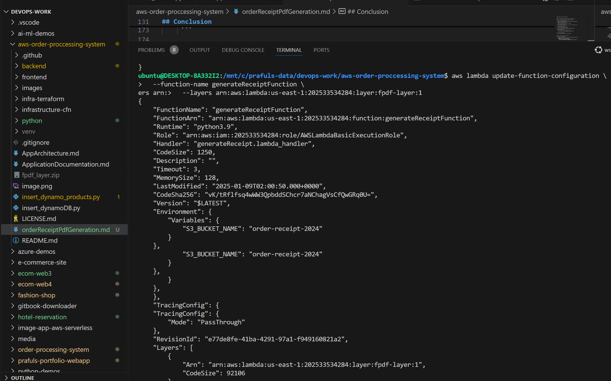

# Using a Lambda Layer to Include External Libraries

## Overview
Lambda Layers allow you to package external libraries separately from your function code. This approach simplifies function deployment and ensures code reuse across multiple Lambda functions.

## Step 1: Create a Lambda Layer

1. **Create a Directory for the Layer**:
   ```bash
   mkdir python
   cd python
   pip install fpdf -t .
   cd ..
   ```

2. **Package the Layer**:
   Zip the directory to prepare it for upload:
   ```bash
   zip -r fpdf_layer.zip python
   ```

---

## Step 2: Upload the Layer

1. **Use the AWS CLI to Publish the Layer**:
   Run the following command to upload your layer:
   ```bash
   aws lambda publish-layer-version \
       --layer-name fpdf-layer \
       --description "Layer with fpdf library" \
       --zip-file fileb://fpdf_layer.zip \
       --compatible-runtimes python3.8 python3.9
   ```

2. **Note the ARN**:
   After running the command, AWS will return an ARN for the uploaded layer. It will look something like this:
   ```
   arn:aws:lambda:us-east-1:123456789012:layer:fpdf-layer:1
   ```

---

## Step 3: Attach the Layer to Your Lambda Function

1. **Update the Lambda Function Configuration**:
   Run the following command to attach the layer to your Lambda function:
   ```bash
   aws lambda update-function-configuration \
       --function-name <function-name> \
       --layers <layer-arn>
   ```
   Replace:
   - `<function-name>`: The name of your Lambda function.
   - `<layer-arn>`: The ARN of the layer you copied earlier.

---

## Step 4: Test Your Lambda Function

After deploying the function with the attached layer, test it using your event payload. The `fpdf` library should now be accessible within the Lambda function.

---

## How to Grab the Layer ARN

### Using the AWS Management Console

1. **Navigate to the Lambda Console**:
   - Go to the [AWS Lambda Console](https://aws.amazon.com/lambda/).

2. **Click on "Layers"**:
   - In the left-hand navigation pane, click on "Layers".

3. **Locate Your Layer**:
   - Find the layer you created in the list.

4. **Copy the ARN**:
   - Click on your layer name to view its details.
   - Under "ARN", copy the Layer ARN. It will look something like this:
     ```
     arn:aws:lambda:us-east-1:123456789012:layer:fpdf-layer:1
     ```

---

### Using the AWS CLI

1. **List Layers**:
   Run the following command to list all layers:
   ```bash
   aws lambda list-layers
   ```
   Output example:
   ```json
   {
       "Layers": [
           {
               "LayerName": "fpdf-layer",
               "LayerArn": "arn:aws:lambda:us-east-1:123456789012:layer:fpdf-layer"
           }
       ]
   }
   ```

2. **List Layer Versions**:
   Run the following command to list versions of a specific layer:
   ```bash
   aws lambda list-layer-versions --layer-name fpdf-layer
   ```
   Output example:
   ```json
   {
       "LayerVersions": [
           {
               "LayerVersionArn": "arn:aws:lambda:us-east-1:123456789012:layer:fpdf-layer:1",
               "Version": 1
           }
       ]
   }
   ```

3. **Copy the Layer Version ARN**:
   Look for the `LayerVersionArn` field in the output and copy it.

---

## Conclusion
By using Lambda Layers, you can separate external libraries from your function code, enabling better reusability and reducing deployment sizes. Ensure the correct `LayerVersionArn` is attached to your Lambda function for proper integration.
```

# Steps to Update Layer ARN and Attach Layer to a Lambda Function

## Option 1: Attach Layer Using the AWS Management Console

1. **Go to the AWS Lambda Console**:
   - Navigate to the [AWS Lambda Console](https://aws.amazon.com/lambda/).

2. **Select Your Lambda Function**:
   - Choose the Lambda function you want to update.

3. **Access the "Layers" Section**:
   - In the "Function overview" section, click on the **"Layers"** panel.

4. **Click on "Add a Layer"**:
   - Click the **Add a layer** button.

5. **Select the Option: "Specify an ARN"**:
   - In the layer source selection, choose **"Specify an ARN"**.

6. **Enter the Layer ARN**:
   - Enter the ARN of the layer you want to attach:
     ```
     arn:aws:lambda:us-east-1:202533534284:layer:fpdf-layer:1
     ```

7. **Save the Configuration**:
   - Click the **Save** button to apply the changes.

---

## Option 2: Attach Layer Using the AWS CLI

1. **Run the AWS CLI Command**:
   - Use the following command to update your Lambda function with the layer:
     ```bash
     aws lambda update-function-configuration \
       --function-name <YourLambdaFunctionName> \
       --layers arn:aws:lambda:us-east-1:202533534284:layer:fpdf-layer:1
     ```


2. **Replace Placeholder Values**:
   - Replace `<YourLambdaFunctionName>` with the name of your Lambda function.

3. **Verify the Update**:
   - Once the command is ex


## ReceiptPdfGenerationFuncion

import json
import os
import boto3
from datetime import datetime
from fpdf import FPDF

# Initialize the S3 client
s3 = boto3.client('s3')

class PDF(FPDF):
    def header(self):
        self.set_font('Arial', 'B', 12)
        self.cell(0, 10, 'Order Receipt', align='C', ln=1)

    def footer(self):
        self.set_y(-15)
        self.set_font('Arial', 'I', 8)
        self.cell(0, 10, f'Page {self.page_no()}', align='C')

def lambda_handler(event, context):
    try:
        # Log the incoming event
        print(f"Received event: {event}")

        # Extract necessary fields
        order_id = event.get('orderId') or event.get('OrderId')
        email = event.get('email')
        product_id = event.get('productId')
        quantity = event.get('quantity')

        if not order_id:
            raise Exception("'orderId' or 'OrderId' is required but not found in the event")
        if not email:
            raise Exception("'email' is required but not found in the event")
        if not product_id:
            raise Exception("'productId' is required but not found in the event")
        if not quantity:
            raise Exception("'quantity' is required but not found in the event")

        # Generate current timestamp
        current_time = datetime.utcnow().isoformat()

        # Receipt content
        receipt = {
            'Order ID': order_id,
            'Email': email,
            'Product ID': product_id,
            'Quantity': quantity,
            'Date': current_time
        }

        # Log receipt data
        print(f"Generated receipt: {receipt}")

        # Get the S3 bucket name from environment variables
        bucket_name = os.environ['S3_BUCKET_NAME'].strip()
        if not bucket_name:
            raise Exception("'S3_BUCKET_NAME' environment variable is missing")

        # Create the PDF receipt
        pdf = PDF()
        pdf.add_page()
        pdf.set_font('Arial', '', 12)

        pdf.cell(0, 10, 'Receipt Details:', ln=1)
        pdf.ln(10)
        for key, value in receipt.items():
            pdf.cell(0, 10, f'{key}: {value}', ln=1)

        # Save the PDF to a local file
        pdf_file_path = f"/tmp/{order_id}.pdf"
        pdf.output(pdf_file_path)

        # Log PDF generation success
        print(f"PDF generated successfully: {pdf_file_path}")

        # Generate the S3 object key
        object_key = f"receipts/{order_id}.pdf"

        # Upload the PDF to S3
        with open(pdf_file_path, 'rb') as pdf_file:
            s3.put_object(
                Bucket=bucket_name,
                Key=object_key,
                Body=pdf_file,
                ContentType='application/pdf'
            )

        # Log successful upload
        print(f"PDF receipt uploaded to S3: s3://{bucket_name}/{object_key}")

        return {
            'statusCode': 200,
            'body': json.dumps({
                'message': 'PDF receipt generated and saved successfully',
                'receiptUrl': f"s3://{bucket_name}/{object_key}"
            })
        }

    except Exception as e:
        # Log the error
        print(f"Error: {e}")
        return {
            'statusCode': 500,
            'body': json.dumps({
                'message': 'PDF receipt generation failed',
                'error': str(e)
            })
        }
