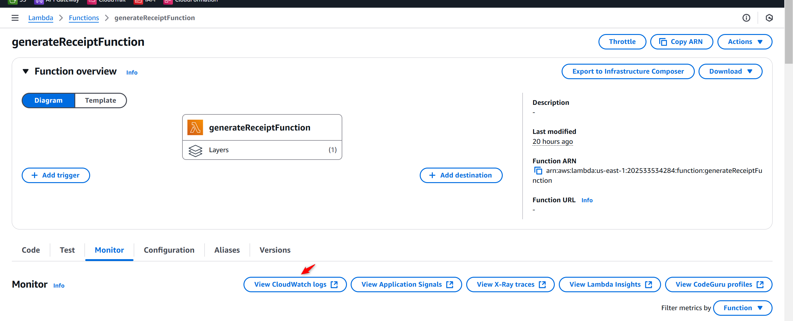
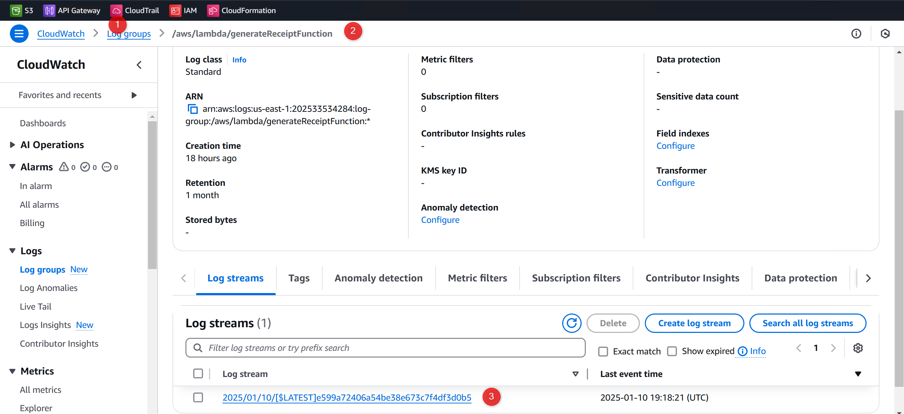
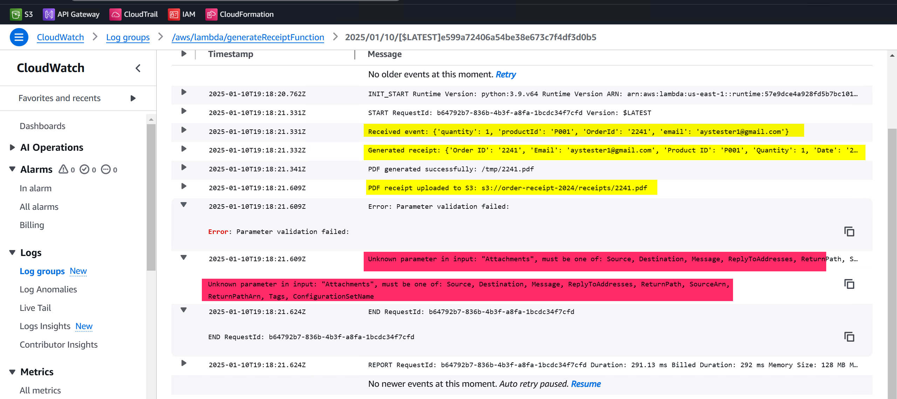

### Troubleshooting
--------------------

## Error 1: Invoice pdf cannot be attached and sent to the email in attachment
# Lambda function Monitoring



- Attach IAM Policy to LambdaEXecutoion role for cloud watch log


{
    "Version": "2012-10-17",
    "Statement": [
        {
            "Effect": "Allow",
            "Action": [
                "logs:CreateLogGroup",
                "logs:CreateLogStream",
                "logs:PutLogEvents"
            ],
            "Resource": "*"
        }
    ]
}

- Attach Policy to IAM LAmbdaexecution Role


- Monitor the logs


- Analyze the cloud watch logs for function execution to monitor what went wrong



- Lambda function code corrected

The error in your code occurs because AWS SES does not natively support sending email attachments through the send_email API. Instead, you need to use the send_raw_email API to include attachments in the email payload.

Here’s how to modify your send_email_with_attachment function to send an email with an attachment using send_raw_email:

import base64
from email.mime.multipart import MIMEMultipart
from email.mime.text import MIMEText
from email.mime.application import MIMEApplication

def send_email_with_attachment(email, pdf_base64, order_id):
    # Sender and recipient
    sender_email = os.environ['SES_SENDER_EMAIL']  # Must be verified in SES
    recipient_email = email  # Recipient email address

    # Email subject and body
    subject = f"Your Order Receipt - Order ID: {order_id}"
    body_text = "Thank you for your order. Please find your receipt attached."
    body_html = """
    <html>
        <body>
            <h1>Thank you for your order!</h1>
            <p>Please find your receipt attached.</p>
        </body>
    </html>
    """

    # Create a MIME multipart message
    msg = MIMEMultipart()
    msg['Subject'] = subject
    msg['From'] = sender_email
    msg['To'] = recipient_email

    # Add the email body
    msg.attach(MIMEText(body_text, 'plain'))
    msg.attach(MIMEText(body_html, 'html'))

    # Decode the base64 PDF content
    pdf_data = base64.b64decode(pdf_base64)

    # Attach the PDF file
    attachment = MIMEApplication(pdf_data, _subtype="pdf")
    attachment.add_header(
        'Content-Disposition',
        'attachment',
        filename=f"{order_id}.pdf"
    )
    msg.attach(attachment)

    # Send the email using SES
    ses = boto3.client('ses')
    try:
        response = ses.send_raw_email(
            Source=sender_email,
            Destinations=[recipient_email],
            RawMessage={
                'Data': msg.as_string()
            }
        )
        print(f"Email sent! Message ID: {response['MessageId']}")
    except Exception as e:
        print(f"Failed to send email: {e}")
        raise
- Key Changes:
 -  Switch to send_raw_email: This API allows sending custom MIME-formatted emails with attachments.
 -  Use MIMEMultipart: Constructs the email body and attachment in MIME format.
 -   Decode Base64 PDF: The PDF is decoded from Base64 format and attached as a file.
 -   Environment Variable: Ensure SES_SENDER_EMAIL is verified in SES.

## Error 2: 
- Failed to send email: An error occurred (AccessDenied) when calling the SendRawEmail operation: User `arn:aws:sts::202533534284:assumed-role/AWSLambdaBasicExecutionRole/generateReceiptFunction' is not authorized to perform `ses:SendRawEmail' on resource `arn:aws:ses:us-east-1:202533534284:identity/praful.can1611@gmail.com'


The error indicates that the Lambda function’s execution role lacks the necessary permissions to call the `ses:SendRawEmail` action. To fix this, you need to update the IAM policy attached to the Lambda function's execution role to include permissions for SES.

### Steps to Fix the Issue

#### 1. Update IAM Policy for the Lambda Role
1. **Open the AWS Management Console**:
   - Navigate to the **IAM** service.

2. **Find the Lambda Execution Role**:
   - Go to **Roles**.
   - Search for the role associated with your Lambda function (`AWSLambdaBasicExecutionRole` in this case).

3. **Attach or Update the Policy**:
   - Edit the permissions by attaching a new policy or updating the existing one.
   - Add the following policy to allow `ses:SendRawEmail`:

   ```json
   {
       "Version": "2012-10-17",
       "Statement": [
           {
               "Effect": "Allow",
               "Action": "ses:SendRawEmail",
               "Resource": [
                   "arn:aws:ses:us-east-1:202533534284:identity/praful.can1611@gmail.com"
               ]
           }
       ]
   }
   ```

   If you want to allow all verified identities, you can use `*` as the resource:
   ```json
   {
       "Version": "2012-10-17",
       "Statement": [
           {
               "Effect": "Allow",
               "Action": "ses:SendRawEmail",
               "Resource": "arn:aws:ses:us-east-1:202533534284:identity/*"
           }
       ]
   }
   ```

4. **Save and Attach the Policy**:
   - Save the policy and ensure it is attached to the Lambda execution role.

---

#### 2. Verify Verified Email in SES
Ensure that the email `praful.can1611@gmail.com` is verified in SES:
- Go to **SES** > **Verified Identities** in the AWS Management Console.
- Verify that `praful.can1611@gmail.com` is listed under verified identities.
- If not verified, verify it and confirm ownership.

---

#### 3. Test the Lambda Function
- Trigger the Lambda function again and check CloudWatch logs for any errors.

---

### Additional Tips
- **Least Privilege Principle**: Grant permissions only for the required SES identity (email) to follow best practices.
- **Retry on Throttling**: If SES quotas are reached, implement retries with exponential backoff in the Lambda function.
- **CloudWatch Logs**: Monitor CloudWatch logs for detailed insights if any other issues arise.

After these changes, your Lambda function should have the necessary permissions to send emails with SES successfully.


- generateReceiptFunction - Logged in detail to log every steps

def send_email_with_attachment(email, pdf_base64, order_id):
    try:
        # Step 1: Logging preparation for email
        print("Step 8.1: Preparing email with attachment.")

        # Sender and recipient
        sender_email = os.environ.get('SES_SENDER_EMAIL')
        if not sender_email:
            raise Exception("'SES_SENDER_EMAIL' environment variable is missing.")
        print(f"Sender email verified: {sender_email}")

        recipient_email = email
        print(f"Recipient email provided: {recipient_email}")

        # Step 2: Setting email subject and body
        subject = f"Your Order Receipt - Order ID: {order_id}"
        print(f"Email subject set: {subject}")

        body_text = "Thank you for your order. Please find your receipt attached."
        body_html = """
        <html>
            <body>
                <h1>Thank you for your order!</h1>
                <p>Please find your receipt attached.</p>
            </body>
        </html>
        """
        print("Email body content created.")

        # Step 3: Creating a MIME multipart message
        msg = MIMEMultipart()
        msg['Subject'] = subject
        msg['From'] = sender_email
        msg['To'] = recipient_email

        # Attaching text and HTML body to the email
        msg.attach(MIMEText(body_text, 'plain'))
        msg.attach(MIMEText(body_html, 'html'))
        print("Text and HTML body added to the email.")

        # Step 4: Decoding base64 PDF content and attaching it
        pdf_data = base64.b64decode(pdf_base64)
        attachment = MIMEApplication(pdf_data, _subtype="pdf")
        attachment.add_header(
            'Content-Disposition',
            'attachment',
            filename=f"{order_id}.pdf"
        )
        msg.attach(attachment)
        print(f"PDF attachment added: {order_id}.pdf")

        # Step 5: Sending the email using SES
        print("Step 8.2: Sending email via SES.")
        response = ses.send_raw_email(
            Source=sender_email,
            Destinations=[recipient_email],
            RawMessage={
                'Data': msg.as_string()
            }
        )

        # Logging the success response
        print(f"Step 8.3: Email sent successfully!")
        print(f"Message ID: {response['MessageId']}")

    except Exception as e:
        # Detailed error logging
        print(f"Error occurred in send_email_with_attachment: {str(e)}")
        raise


- Logged each steps to observe the behavior


- Let's Test the PDF attachment received in email

    - Place an order
    

    - Monitor cloudwatch logs for Lambda function if email has sent
    

    - Email confirmation received
    

    - Invoice PDF attachment received in email
    

    
