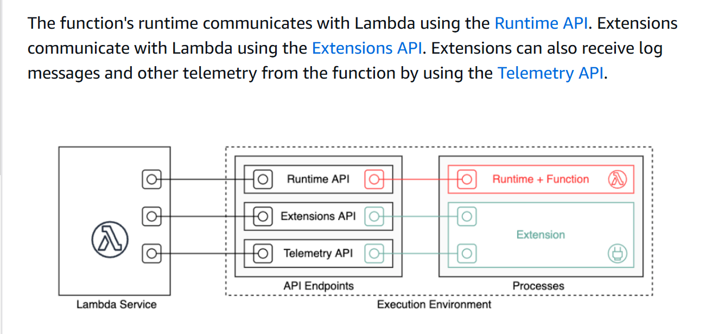
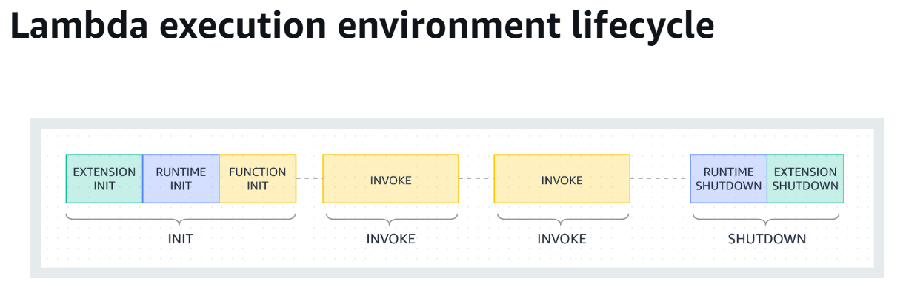
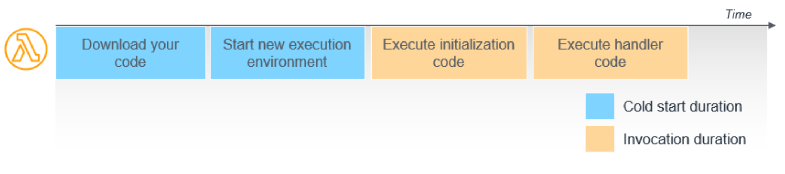

# 🚀 Monitoring Cold Starts, Warm Starts, and Optimizing AWS Lambda for Cost and Performance

AWS Lambda's **cold starts** and **warm starts** are critical factors influencing application performance and cost. This guide explains how to monitor **cold starts** and **warm starts** using AWS X-Ray, analyze their impact, and optimize your Lambda function for better cost-efficiency and performance.





#### Init phase

 In the Init phase, Lambda performs three tasks:
- Start all extensions (Extension init)
- Bootstrap the runtime (Runtime init)
- Run the function's static code (Function init)
- Run any before-checkpoint runtime hooks (Lambda SnapStart only)


## **1. Understanding Cold Starts and Warm Starts**
- **Cold Start**: Occurs when AWS Lambda initializes a new execution environment to handle an invocation. This includes downloading the code, setting up the runtime, and initializing the function, which adds latency.

#### Cold starts and latency



When Lambda receives a request to run a function via the Lambda API,
1. the service first prepares an execution environment.
2. During this initialization phase, the service downloads your code
3. starts the environment, and runs any initialization code outside of the main handler.
Finally, Lambda runs the handler code.
- the first two steps of downloading the code and setting up the environment are frequently referred to as a “cold start”.You are not charged for this time, but it does add latency to your overall invocation duration.


- **Warm Start**: Happens when an invocation reuses an already-initialized execution environment, resulting in lower latency.


---

## **2. Monitoring Cold Starts Using AWS X-Ray**

### **Enable X-Ray Tracing**
To capture detailed Lambda traces, enable X-Ray tracing for your function.

#### **Using AWS Management Console**:
1. Navigate to the **Lambda Console**.
2. Select the target Lambda function.
3. Go to the **Configuration** tab and select **Monitoring and Operations tools**.
4. Enable **Active tracing**.
5. Save changes.

#### **Using AWS CLI**:
```bash
aws lambda update-function-configuration \
    --function-name <FUNCTION_NAME> \
    --tracing-config Mode=Active
```

#### **Using Terraform**:
```hcl
resource "aws_lambda_function" "example" {
  function_name = "example"
  # Other configurations
  tracing_config {
    mode = "Active"
  }
}
```

---

### **Trigger and Capture Invocations**
- Invoke your Lambda function manually or generate traffic using tools like **AWS CLI**, **Postman**, or automated scripts.
- X-Ray will capture traces for both cold and warm starts.

---

### **Analyze X-Ray Traces**
#### **Access X-Ray Console**:
1. Open the [AWS X-Ray Console](https://console.aws.amazon.com/xray/).
2. Navigate to the **Service Map** to visualize the services interacting with your Lambda.
3. Click your Lambda function to view detailed traces.

#### **Identifying Cold Starts**:
1. Open the **Traces** tab and select a specific trace.
2. Look for the **Initialization** segment:
   - **Cold Start**: Contains an **Initialization** segment.
   - **Warm Start**: Does not include this segment.
3. Measure the time taken by the **Initialization** segment for cold starts.

#### **Filter Cold Starts**:
Use the following filter expression in the X-Ray **Traces** tab:
```plaintext
has(Initialization)
```

---

### **Using CloudWatch Logs for Cold Start Detection**
Enable **CloudWatch Logs** for your Lambda function and use the following query to identify cold starts:
```sql
fields @timestamp, @message
| filter @message like /INIT/
| sort @timestamp desc
| limit 20
```
- **INIT START** and **INIT END** logs indicate cold start events.

---

## **3. Monitoring Warm Starts**
Warm starts can be monitored similarly:
- Check traces without an **Initialization** segment in X-Ray.
- Analyze the **Invocation** segment to measure execution duration and latency for reused environments.

---

## **4. Optimizing AWS Lambda for Cost and Performance**

### **Strategies to Reduce Cold Start Latency**
1. **Enable Provisioned Concurrency**:
   - Keeps pre-initialized environments ready to handle requests.
   - Configure it via AWS Management Console, CLI, or IaC (e.g., Terraform).

   Example (CLI):
   ```bash
   aws lambda put-provisioned-concurrency-config \
       --function-name <FUNCTION_NAME> \
       --qualifier <ALIAS_NAME> \
       --provisioned-concurrent-executions 5
   ```

2. **Optimize Deployment Package**:
   - Minimize the size of your deployment package by removing unnecessary dependencies.
   - Use AWS Lambda Layers to separate libraries from your main code.

3. **Choose the Right Runtime**:
   - Use lighter runtimes like **Node.js** or **Python** for faster initialization.
   - Avoid heavy initialization logic in your function handler.

4. **Use Environment Variables**:
   - Store configuration values in environment variables to reduce initialization logic.

5. **Keep Functions Stateless**:
   - Avoid storing state between invocations to improve reusability and reduce cold start overhead.

---

### **Optimize for Cost**
1. **Right-Size Memory Allocation**:
   - Use Lambda Power Tuning (AWS Step Functions) to determine the optimal memory allocation for performance and cost.

2. **Reduce Idle Time**:
   - Optimize code logic to avoid unnecessary wait times during execution.

3. **Consolidate Small Functions**:
   - Combine related functions to reduce the number of invocations, which can lower costs.

---

### **Automating Monitoring and Alerts**
1. **CloudWatch Alarms**:
   - Create alarms for high duration or error rates.
   - Example CLI command:
     ```bash
     aws cloudwatch put-metric-alarm \
         --alarm-name "HighLambdaDuration" \
         --metric-name Duration \
         --namespace AWS/Lambda \
         --statistic Average \
         --threshold 1000 \
         --comparison-operator GreaterThanThreshold \
         --dimensions Name=FunctionName,Value=<FUNCTION_NAME> \
         --evaluation-periods 1 \
         --period 60
     ```

2. **Set up AWS X-Ray Groups**:
   - Define X-Ray groups with filter expressions to track cold starts separately.

---

## **5. Best Practices for Lambda Performance**
- **Measure Regularly**: Continuously monitor cold start and warm start performance using X-Ray and CloudWatch Logs.
- **Leverage Caching**: Use Amazon ElastiCache or in-memory data stores to minimize external data fetch delays.
- **Split Large Functions**: Break large functions into smaller, modular ones for better reusability and faster performance.

---

## **6. Conclusion**
By monitoring cold starts and warm starts with AWS X-Ray and optimizing your Lambda function for cost and performance, you can build efficient, scalable serverless applications. Regular analysis and proactive adjustments are key to maintaining a seamless user experience.

Let me know if you need more details on any specific step! 🚀
```