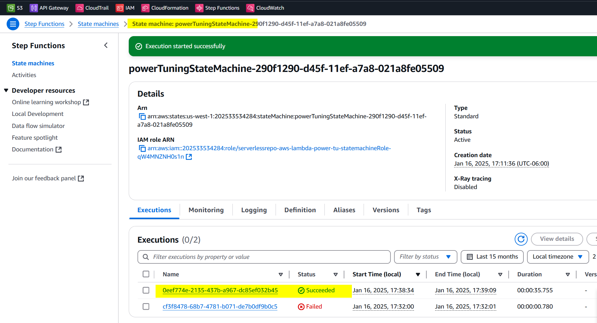
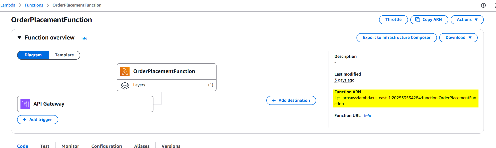
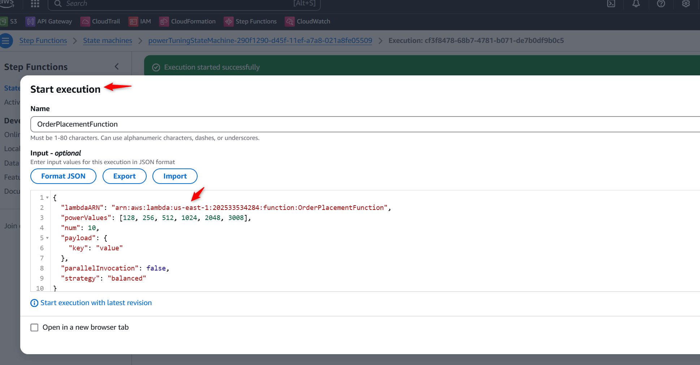
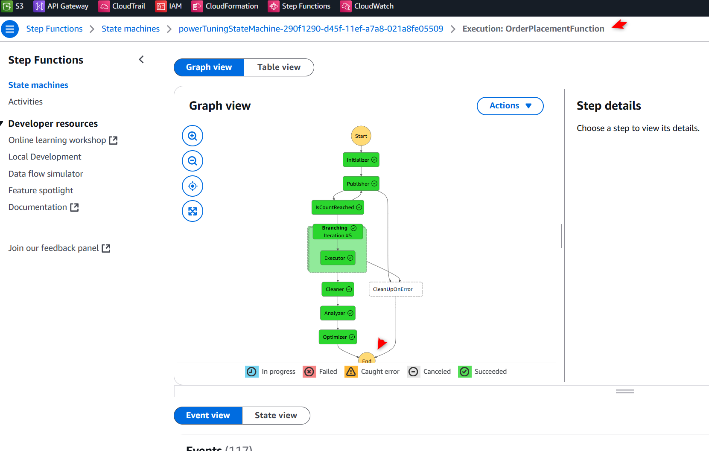
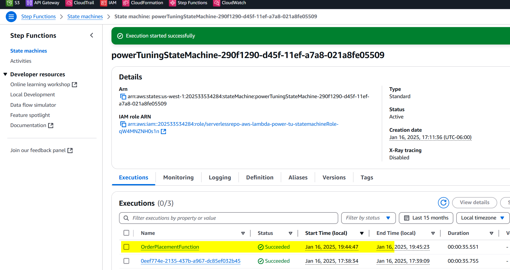
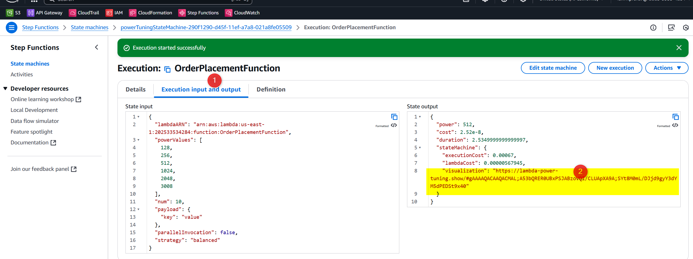
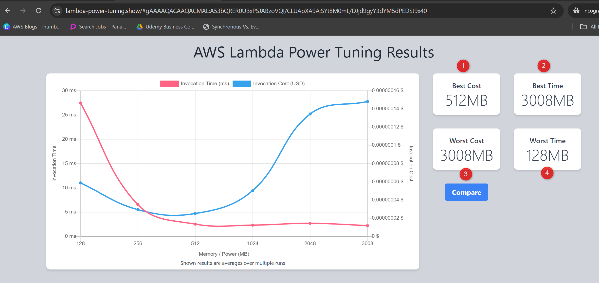

# Lambda Power Tuning Tool Usage Documentation

This documentation explains how to access and use the **Lambda Power Tuning Tool** for optimizing AWS Lambda functions in terms of cost and performance. Additionally, it provides steps to deploy a standalone browser-based UI for ease of use.

---

## Accessing the Lambda Power Tuning Tool

---

## Deploying a Standalone Lambda Power Tuning UI

For a user-friendly, browser-based interface, deploy the **Lambda Power Tuning UI** frontend application.

### Steps to Deploy:
1. **Clone the Frontend Repository**:
   - Visit [Lambda Power Tuning UI GitHub](https://github.com/maddevsio/aws-lambda-power-tuning-ui).
   - Clone or download the repository.
   OR
   - Direct Link: https://serverlessrepo.aws.amazon.com/applications/arn:aws:serverlessrepo:us-east-1:451282441545:applications~aws-lambda-power-tuning

2. **Set Up Backend**:
   - Ensure the Lambda Power Tuning backend is deployed in your AWS environment via CloudFormation.

3. **Configure the UI**:
   - Modify the frontend configuration file (`config.js` or equivalent) to include:
     - Your Step Functions ARN.
     - AWS region.
     - Any necessary credentials.

4. **Host the UI**:
   - Deploy the application to an S3 bucket with **static website hosting** enabled.
   - Alternatively, host it on any web server.

5. **Access the UI**:
   - Open the public URL of the hosted UI (e.g., S3 bucket's endpoint).
   - Use the interface to start new executions and monitor results.

---

## Direct Link from AWS Console

For immediate access without deploying a standalone UI:
1. Use the **AWS Step Functions Console** as the primary interface for Lambda Power Tuning.
2. Navigate to **Step Functions > Executions** to manage and analyze tuning executions.
3. There is no direct public-facing UI link; operations are performed via the AWS Console.

---

### Using the AWS Management Console
1. **Login to AWS Console**:
   - Open the [AWS Management Console](https://aws.amazon.com/console/).

2. **Navigate to Step Functions**:
   - Search for **Step Functions** in the AWS Console's search bar.
   - Click on **Step Functions** to open its dashboard.

   ### PowwerTune Lambda functions for Order Processing System

- State machine: powerTuningStateMachine- successfully deployed

3. **Locate the State Machine**:
   - Find the Lambda Power Tuning state machine deployed in your account. 
   - Typically, its name is something like `powerTuningStateMachine` (if deployed using the provided CloudFormation template).

4. **Start a New Execution**:
   - Select the state machine by clicking on its name.
   - Click the **Start Execution** button in the top-right corner.
   - Provide the required input parameters in JSON format:
     - **Lambda ARN**: ARN of the Lambda function to analyze.
     - **Payload**: The event payload for testing.
     - **Power Values**: List of memory sizes to test (e.g., `[128, 256, 512, 1024, 2048, 3008]`).
     - **Strategy**: Optimization strategy—`cost`, `speed`, or `balanced`.
     - **Parallel Invocation**: `false` for single runs, `true` for concurrency testing.

    
  
      Example JSON Input
        {
        "lambdaARN": "arn:aws:lambda:us-east-1:123456789012:function:your-lambda-function-name",
        "powerValues": [128, 256, 512, 1024, 2048, 3008],
        "num": 10,
        "payload": {
            "key": "value"
        },
        "parallelInvocation": false,
        "strategy": "balanced"
        }

    - lambdaARN: Replace with your Lambda function's ARN (e.arn:aws:lambda:us-east-1:123456789012:function:generateReceiptFunction).
    - powerValues: List of memory configurations to test (128 MB to 3008 MB).
    - num: The number of test invocations per configuration.
    - payload: The input payload for your Lambda function. Customize this based on the function you are testing.
    - parallelInvocation: Set to false for serial testing.
    - strategy: Choose one of the following:
    - cost: Optimize for cost.
    - speed: Optimize for performance.
    - balanced: Optimize for a mix of both.

  ### PowerTune  'OrderPlacementFunction' Lambda Function
    - Copy Function ARN
    

    - Copy powertune Test JSON input
    '''
    {
  "lambdaARN": "arn:aws:lambda:us-east-1:123456789012:function:your-lambda-function-name",
  "powerValues": [128, 256, 512, 1024, 2048, 3008],
  "num": 10,
  "payload": {
    "key": "value"
  },
  "parallelInvocation": false,
  "strategy": "balanced"
    }

    '''
- Start Execution - Input Script
 

- Execution Complete
 

- Executions list
 

- Execution input and output
    - Copy the "visualization" URL and open in Browser to see the Result in static UI to Analyze

- Access the UI of AWS Lambda Power Tuning Results

5. **Analyze Results**:
   - View execution details and results, which include metrics on cost and performance.

# 📊 Analysis of Lambda Power Tuning Results

The graph presents a comparison of **Invocation Time (ms)** and **Invocation Cost (USD)** across various memory allocations for the AWS Lambda function.

---

## 🔍 Observations:
1. **💲 Best Cost (512 MB):**
   - At **512 MB**, the cost is minimized.
   - The execution time is slightly higher than higher memory configurations but remains efficient.
   - ✅ **Ideal for cost-sensitive workloads.**

2. **⚡ Best Time (3008 MB):**
   - At **3008 MB**, the invocation time is the fastest.
   - ✅ **Best for performance-critical tasks** where speed is the priority over cost.

3. **💸 Worst Cost (3008 MB):**
   - The highest cost is observed at **3008 MB**, the maximum memory allocation.
   - ❌ Not cost-efficient unless extremely low latency is required.

4. **🐢 Worst Time (128 MB):**
   - At **128 MB**, the invocation time is the slowest.
   - ❌ Suitable only for workloads where latency and cost are less critical.

---

## 🏁 Conclusion:
- **Balanced Strategy:**
  - Considering both cost and performance, **512 MB** is the optimal configuration.
  - Provides a good trade-off between cost-efficiency and performance.

- **Use Case Decisions:**
  - For **cost-sensitive applications**, stick to **512 MB** to minimize costs while ensuring acceptable performance.
  - For **performance-critical applications** (e.g., real-time workflows), allocate **3008 MB** to achieve the fastest execution times.

---

## 🔧 Recommendations for Your Serverless Order Processing System:
### 1️⃣ **Memory Allocation:**
   - Allocate **512 MB** for cost-optimized workloads.
   - Use **3008 MB** for critical paths that require real-time responsiveness, such as:
     - Notifications.
     - Immediate database updates.

### 2️⃣ **📋 Testing:**
   - Test with **real-world payloads** to validate that memory allocation aligns with the application's performance and cost goals.

### 3️⃣ **📈 Monitoring:**
   - Leverage **AWS CloudWatch Logs and Metrics** to:
     - Continuously monitor execution times and costs.
     - Identify potential bottlenecks or areas for cost savings.
   - Adjust memory allocation dynamically as workloads evolve.

### 4️⃣ **⚖️ Cost-Performance Balance:**
   - If the application includes both **cost-sensitive** and **performance-sensitive** workflows:
     - Split these workflows into **separate Lambda functions** with tailored memory allocations.

---

## 🚀 Benefits:
- ✅ **Cost Savings:** Optimize resource usage to reduce unnecessary spending.
- ✅ **Performance Boost:** Enhance response times for critical operations.
- ✅ **Scalability:** Enable seamless scaling for various workloads without compromising efficiency.

By following these strategies, your **serverless order processing system** will achieve an optimal balance of performance and cost-efficiency. 🚀

## Summary

- **Primary Access**: AWS Management Console (Step Functions).
- **Optional UI**: Deploy the Lambda Power Tuning UI for a user-friendly frontend.
- **Execution Details**:
  - Input parameters include Lambda ARN, payload, memory values, and strategy.
  - Results provide detailed insights into cost and performance trade-offs.
