# 🚀 AWS Serverless Project: Scalable & Secure Order Processing System 🌐

## 📖 Complete Documentation:  
👉 [AWS Serverless Order Processing System](https://praful.cloud/aws-serverless-order-processing-system)


## 🏗️ Architecture Diagram:  


# Real-Time Order Processing System

# 🖥️ User Interface Design
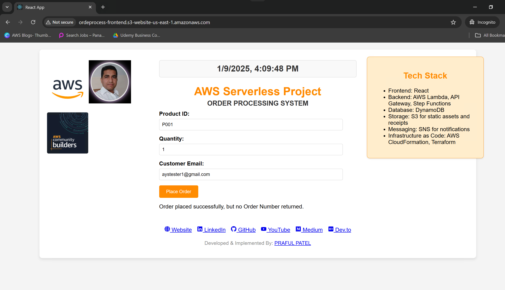

# 📚 Comprehensive Guide to Infrastructure Setup, Security, and Troubleshooting 🚀

## 🛠️ Complete Documentation
1. 📄 [Order Receipt PDF Generation](1.orderReceiptPdfGeneration.md)
2. 🛡️ [Secure Architecture](2.secureArchiteture.md)
3. 🐞 [Troubleshooting Tips](3.Troubelshooting.md)

 
## Table of Contents
- [Project Use Case](#project-use-case)
- [Architecture Overview](#architecture-overview)
- [Key Requirements](#key-requirements)
- [Tech Stack](#tech-stack)
- [Step-by-Step Implementation](#step-by-step-implementation)
  - [1. Frontend (React + API Gateway)](#frontend-react--api-gateway)
  - [2. API Gateway Setup](#api-gateway-setup)
  - [3. AWS Step Functions](#aws-step-functions)
  - [4. Order Validation Lambda](#order-validation-lambda)
  - [5. Payment Processing Lambda](#payment-processing-lambda)
  - [6. Update Inventory Lambda](#update-inventory-lambda)
  - [7. Send Notification (SNS)](#send-notification-sns)
  - [8. Generate and Store Receipt (S3)](#generate-and-store-receipt-s3)
          - [Order Receipt PDF Generation](1.orderReceiptPdfGeneration.md)
  - [9. Monitoring and Error Handling](#monitoring-and-error-handling)
- [AWS Step Functions Workflow Example](#aws-step-functions-workflow-example)
- [Benefits of this Approach](#benefits-of-this-approach)
- [Project Structure](#project-structure)
- [Project Implementation](#project-implementation)
  - [DynamoDB Setup](#dynamodb-setup)
  - [Lambda Function Deployment](#lambda-function)
  - [S3 Frontend Deployment](#s3---static-webapp)
- [Challenges & Troubleshooting](#challenges--troubleshooting)
- [WebApp Test](#webapp-test)
- [DevOps](#devops)
  - [Source Code Management (Version Control)](#phase-1-source-code-management-version-control)
  - [Continuous Integration (CI)](#phase-2-continuous-integration-ci)
  - [Configure Secrets](#configure-secrets)
- [Conclusion](#conclusion)

## Project Use Case
This project demonstrates a real-time order processing system built using serverless architecture on AWS. It manages order placement, validation, payment, inventory updates, notifications, and receipt generation.

## Architecture Overview
The system is designed using AWS services such as API Gateway, Lambda, Step Functions, DynamoDB, SNS, and S3. The architecture ensures scalability, availability, and real-time order processing.

## Key Requirements
- Real-time order processing with low latency.
- Secure and reliable API integration.
- Seamless interaction between microservices.
- Scalable and cost-effective solution.

## Tech Stack
- **Frontend:** React
- **Backend:** AWS Lambda, API Gateway, Step Functions
- **Database:** DynamoDB
- **Storage:** S3 for static assets and receipts
- **Messaging:** SNS for notifications
- **Infrastructure as Code:** AWS CloudFormation, Terraform


# Real-Time Order Processing System

## Architecture Overview

The real-time order processing system is designed with a serverless architecture using AWS services to ensure scalability, availability, and high performance. The following components are used:

# AWS Serverless Order Processing Architecture

## Architecture Type: Event-Driven with Asynchronous Processing

This architecture can be classified as **event-driven** with elements of **asynchronous processing**, leveraging serverless AWS services to create a modular, scalable, and efficient order processing system.

---

## 1. Event-Driven Architecture

### Definition:
An event-driven architecture revolves around the production, detection, and consumption of events. Events trigger processes or workflows.

### Components in This Project:
- **Amazon SNS**: Publishes events like order confirmation or notifications, triggering email processes.
- **AWS Lambda**: Invoked in response to specific events, such as API Gateway requests or Step Functions transitions.
- **DynamoDB**: Changes in state (e.g., inventory updates) act as events triggering downstream processes.

### Why Event-Driven:
- The workflow begins with an event (e.g., an API call to place an order).
- Each subsequent step in the process (validation, payment, inventory update, notification) is triggered by the output of the previous step.
- Events are loosely coupled, enabling modularity and scalability.

---

## 2. Asynchronous Processing

### Definition:
In asynchronous processing, tasks are executed without waiting for previous tasks to complete. Components communicate via events or messages.

### Components in This Project:
- **Step Functions**: Manages workflow transitions between states asynchronously.
- **SNS**: Delivers notifications without requiring sender confirmation.
- **Lambda**: Processes tasks independently, enabling concurrent execution.

### Why Asynchronous:
- Once an order is validated and payment processed, inventory updates and email notifications are initiated without user confirmation.
- Each Lambda function processes its task independently, supporting parallel execution of workflows.

---

## Architecture Overview

### Components:
1. **Frontend/UI**:
   - A static web application hosted on S3 serves as the user entry point.

2. **API Gateway**:
   - Exposes RESTful APIs to interact with backend services.

3. **AWS Lambda**:
   - Executes core logic for order validation, payment processing, inventory updates, and sending notifications.

4. **Step Functions**:
   - Orchestrates the workflow, defining states for validation, payment, inventory updates, and notifications.

5. **DynamoDB**:
   - Stores product inventory and order details.

6. **SNS**:
   - Publishes notifications for order confirmation, triggering email delivery.

7. **CloudWatch**:
   - Logs events, monitors performance, and captures errors for debugging.

---

## Key Characteristics of This Architecture

### Event-Driven:
- SNS and Step Functions are triggered by specific workflow events.
- State transitions in Step Functions are driven by task completions.

### Asynchronous:
- Processing occurs independently in Lambda functions, reducing latency and enabling parallel task execution.

### Serverless:
- Leveraging AWS managed services eliminates the need to manage servers.

---

## Advantages of This Architecture

1. **Scalability**:
   - Lambda functions scale independently in response to incoming events.
2. **Modularity**:
   - Decoupled components (e.g., validation, payment, notification) simplify extension and maintenance.
3. **Cost Efficiency**:
   - Pay-per-use model ensures cost efficiency, with resources consumed only when events occur.
4. **Resilience**:
   - Failures in one component (e.g., notification delivery) do not affect others due to loose coupling.
5. **Real-Time Processing**:
   - Asynchronous events enable near real-time order processing and notification.

---

## Comparison with Synchronous Architecture

### Synchronous:
- In a synchronous system, each component waits for the previous one to complete its task (e.g., HTTP requests between tightly coupled services).

### In This Project:
- Components like Lambda, SNS, and Step Functions allow tasks to execute asynchronously, making the system more responsive and scalable.

---

## Summary
This project exemplifies an **event-driven serverless architecture**, leveraging AWS services to achieve modularity, scalability, and efficiency in order processing.


### User Interface (UI)
- **Frontend:** Built with React, hosted on AWS S3, and delivered via AWS CloudFront for global reach and caching.
- **Purpose:** Provides a seamless user experience for order placement and status updates.
- Note: Improved Frontend UI interface
 

### Backend
- **API Gateway:** Serves as the entry point for all API requests from the frontend.
- **AWS Lambda:** Used for serverless processing of various backend operations, including order validation, payment processing, and inventory management.
- **Step Functions:** Orchestrates the entire order processing workflow, ensuring tasks are executed in the correct sequence.
- **DynamoDB:** Serves as the database for storing order details, inventory data, and transaction logs.

### Additional Services
- **SNS (Simple Notification Service):** Sends order confirmation notifications to users via email.
- **S3 (Simple Storage Service):** Stores order receipts and other related files.
- **CloudWatch:** Provides monitoring and logging for tracking workflow execution, errors, and performance metrics.

## Key Requirements

### Real-time Order Submission
- **Users can place orders** via the e-commerce frontend, which sends requests to the backend through API Gateway.
- **Order requests** are sent to AWS Lambda functions for further processing.

### Order Validation
- **Validate incoming orders** by checking product availability in DynamoDB.
- **Payment verification** is conducted to ensure successful transactions before proceeding.

### Inventory Management
- **Once an order is placed,** inventory is deducted from the database using Lambda functions to maintain accuracy.
- **Step Functions** manage the workflow to ensure inventory updates occur only after successful payment.

### Payment Processing
- **Integrates with third-party payment gateways** to process user payments.
- **Lambda functions** handle payment verification and capture the transaction result.

### Notification
- **Users receive order confirmation** via email notifications using Amazon SNS after successful order processing.

### Store Order Receipts
- **Receipts are generated** for each order and stored in S3 for secure storage.
- **Receipts can be accessed later** for order tracking and record-keeping.

### Monitoring
- **CloudWatch** is used to monitor various components of the system.
  - **Flow Monitoring:** Tracks the progress of order processing through Step Functions.
  - **Error Handling:** Logs any errors that occur during Lambda function execution.
  - **Execution Times:** Monitors execution times for Lambda functions to identify performance bottlenecks.

## Conclusion
The architecture ensures a seamless, scalable, and reliable order processing system with real-time data handling, secure transactions, and effective user notifications. The integration of AWS services enables cost-effective scaling, while monitoring tools ensure robust error handling and performance tracking.


## Step-by-Step Implementation

### 1. Frontend (React + API Gateway)
- Set up the React frontend to interact with the backend via API Gateway.
- Deploy the frontend to S3 with CloudFront for content delivery and caching.

### 2. API Gateway Setup
- Create REST API endpoints to trigger the Lambda functions.

### 3. AWS Step Functions
- Design a Step Functions workflow to orchestrate the order processing tasks.

### 4. Order Validation Lambda
- Implement a Lambda function to validate order data received from the frontend.

### 5. Payment Processing Lambda
- Create a Lambda function to handle payment processing and integration with a mock payment service.

### 6. Update Inventory Lambda
- Add a Lambda function to update inventory in the DynamoDB table after order placement.

### 7. Send Notification (SNS)
- Use SNS to send order confirmation notifications to customers.

### 8. Generate and Store Receipt (S3)
- Generate an order receipt and store it in S3 for later retrieval.

### 9. Monitoring and Error Handling
- Implement CloudWatch for monitoring Lambda functions, API Gateway, and Step Functions.

## AWS Step Functions Definition

## Frontend Web Application


## Step Functions


## Step Functions-Success


## Step Workflows


Order Created : Order NO: 3625


Receipt Generated


Step Succssed


## Lambda Functions

OrderPlacementFunction


## DynamoDB Tables


Inventory Table


Order Table


Order No: 3625 


## Order Receipt Generated and stored to S3 Table


Order No: 3625 Receipt


- Note: Improvement: In earlier version order receipt was generated as JSON doc, but in this version it has converted into pdf format. 
## Pdf receipt generated

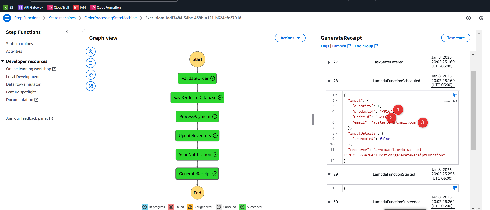
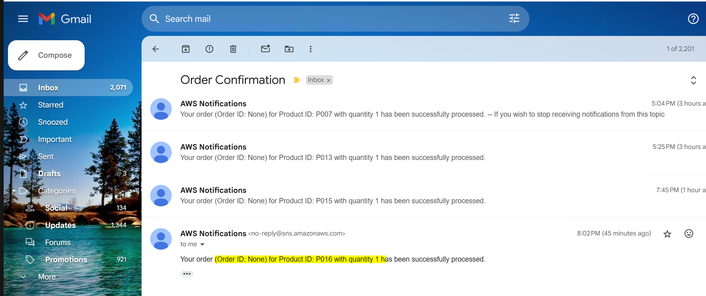
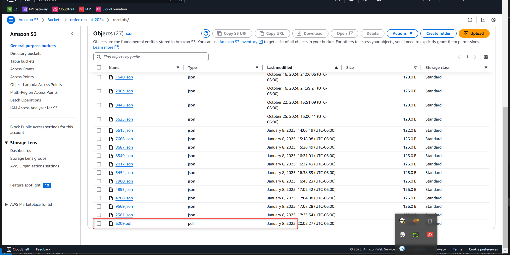
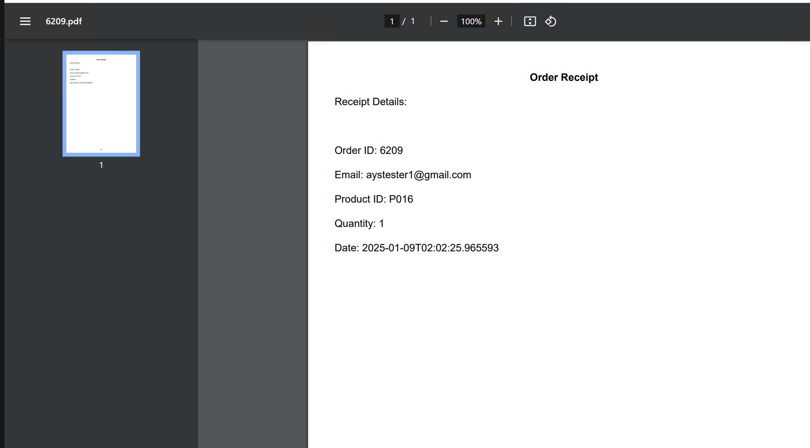


## SES configuration

# Setting Up SES for Sending Emails with Lambda

This documentation provides detailed steps for configuring Amazon Simple Email Service (SES) to send emails with attachments (like a PDF invoice) using AWS Lambda. The process includes SES configuration, setting permissions, and updating Lambda code.

## Prerequisites

- Access to an AWS account with permissions to configure SES, Lambda, and IAM.
- Verified email addresses in SES (both sender and recipient).
- A Lambda function set up in the AWS Management Console.

---

## Step 1: Verify Email Addresses in SES

1. **Log in to the AWS Management Console**.
2. Navigate to **SES** (Simple Email Service).
3. In the left-hand menu, select **Configuration** > **Identities**.
4. Click **Create identity**.
5. Choose **Email address** as the identity type.
6. Enter the email address you want to verify (e.g., `praful.can1611@gmail.com`).
7. Click **Create identity**.
8. Check your email inbox for a verification email from AWS SES.
9. Click the verification link in the email.
10. Repeat these steps to verify the recipient email address.

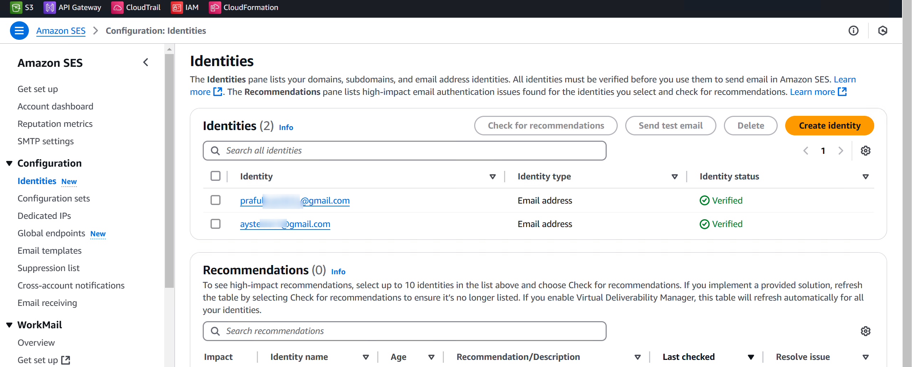

---

## Step 2: Configure IAM Permissions for Lambda

To allow the Lambda function to send emails using SES:

1. Navigate to **IAM** in the AWS Management Console.
2. Select **Roles** in the left-hand menu.
3. Find the role associated with your Lambda function (e.g., `AWSLambdaBasicExecutionRole`).
4. Click the role name to edit it.
5. Attach the following policy:

    ```json
    {
      "Version": "2012-10-17",
      "Statement": [
        {
          "Effect": "Allow",
          "Action": "ses:SendRawEmail",
          "Resource": "*"
        }
      ]
    }
    ```

6. Click **Review policy**, then **Save changes**.

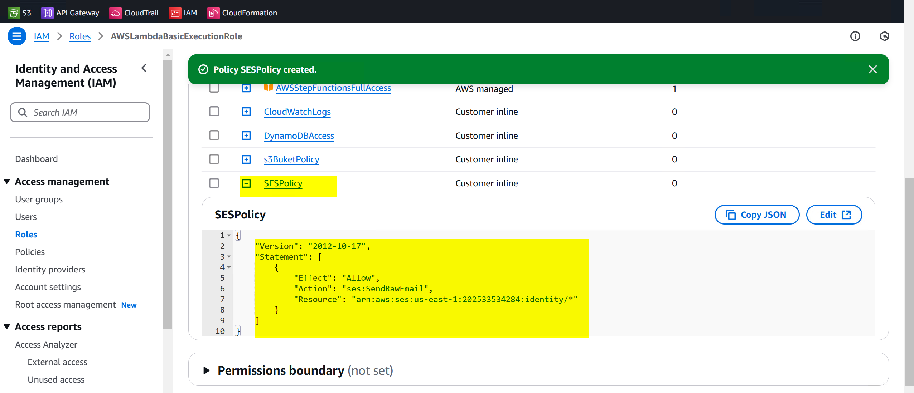

---

## Step 3: Update Lambda Code

### Lambda Function Code

```python
import json
import os
import boto3
import base64
from datetime import datetime
from fpdf import FPDF
from email.mime.multipart import MIMEMultipart
from email.mime.text import MIMEText
from email.mime.application import MIMEApplication

# Initialize the S3 and SES clients
s3 = boto3.client('s3')
ses = boto3.client('ses')

class PDF(FPDF):
    def header(self):
        self.set_font('Arial', 'B', 12)
        self.cell(0, 10, 'Order Receipt', align='C', ln=1)

    def footer(self):
        self.set_y(-15)
        self.set_font('Arial', 'I', 8)
        self.cell(0, 10, f'Page {self.page_no()}', align='C')

def lambda_handler(event, context):
    try:
        # Log the incoming event
        print(f"Received event: {event}")

        # Extract necessary fields
        order_id = event.get('orderId') or event.get('OrderId')
        email = event.get('email')
        product_id = event.get('productId')
        quantity = event.get('quantity')

        if not order_id:
            raise Exception("'orderId' or 'OrderId' is required but not found in the event")
        if not email:
            raise Exception("'email' is required but not found in the event")
        if not product_id:
            raise Exception("'productId' is required but not found in the event")
        if not quantity:
            raise Exception("'quantity' is required but not found in the event")

        # Generate current timestamp
        current_time = datetime.utcnow().isoformat()

        # Receipt content
        receipt = {
            'Order ID': order_id,
            'Email': email,
            'Product ID': product_id,
            'Quantity': quantity,
            'Date': current_time
        }

        # Create the PDF receipt
        pdf = PDF()
        pdf.add_page()
        pdf.set_font('Arial', '', 12)

        pdf.cell(0, 10, 'Receipt Details:', ln=1)
        pdf.ln(10)
        for key, value in receipt.items():
            pdf.cell(0, 10, f'{key}: {value}', ln=1)

        # Save the PDF to a local file
        pdf_file_path = f"/tmp/{order_id}.pdf"
        pdf.output(pdf_file_path)

        # Log PDF generation success
        print(f"PDF generated successfully: {pdf_file_path}")

        # Generate the S3 object key
        bucket_name = os.environ['S3_BUCKET_NAME']
        object_key = f"receipts/{order_id}.pdf"

        # Upload the PDF to S3
        with open(pdf_file_path, 'rb') as pdf_file:
            s3.put_object(
                Bucket=bucket_name,
                Key=object_key,
                Body=pdf_file,
                ContentType='application/pdf'
            )

        # Send the email with the attachment using SES
        send_email_with_attachment(email, pdf_file_path, order_id)

        return {
            'statusCode': 200,
            'body': json.dumps({
                'message': 'PDF receipt generated, saved to S3, and emailed successfully',
                'receiptUrl': f"s3://{bucket_name}/{object_key}"
            })
        }

    except Exception as e:
        # Log the error
        print(f"Error: {e}")
        return {
            'statusCode': 500,
            'body': json.dumps({
                'message': 'PDF receipt generation failed',
                'error': str(e)
            })
        }

def send_email_with_attachment(email, pdf_file_path, order_id):
    print("Step: Preparing email with attachment.")

    # Sender and recipient
    sender_email = os.environ['SES_SENDER_EMAIL']
    recipient_email = email

    # Email subject and body
    subject = f"Your Order Receipt - Order ID: {order_id}"
    body_text = "Thank you for your order. Please find your receipt attached."
    body_html = """
    <html>
        <body>
            <h1>Thank you for your order!</h1>
            <p>Please find your receipt attached.</p>
        </body>
    </html>
    """

    # Create a MIME multipart message
    msg = MIMEMultipart()
    msg['Subject'] = subject
    msg['From'] = sender_email
    msg['To'] = recipient_email

    # Add the email body
    msg.attach(MIMEText(body_text, 'plain'))
    msg.attach(MIMEText(body_html, 'html'))

    # Attach the PDF
    with open(pdf_file_path, 'rb') as pdf_file:
        attachment = MIMEApplication(pdf_file.read(), _subtype="pdf")
        attachment.add_header(
            'Content-Disposition',
            'attachment',
            filename=f"{order_id}.pdf"
        )
        msg.attach(attachment)

    # Send the email using SES
    response = ses.send_raw_email(
        Source=sender_email,
        Destinations=[recipient_email],
        RawMessage={
            'Data': msg.as_string()
        }
    )
    print(f"Email sent successfully! Message ID: {response['MessageId']}")
```
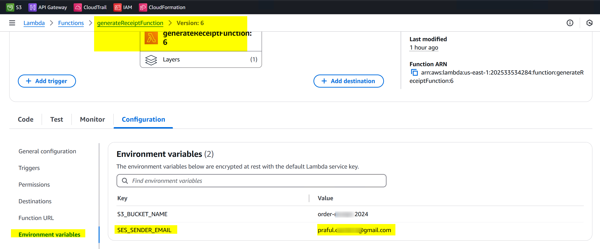

---

## Step 4: Test the Lambda Function

1. Navigate to the Lambda function in the AWS Management Console.
2. Click **Test**.
3. Create a new test event with the following JSON structure:

    ```json
    {
        "orderId": "12345",
        "email": "recipient@example.com",
        "productId": "P001",
        "quantity": 2
    }
    ```

4. Click **Test** to execute the function.
5. Check the recipient's inbox for the email with the PDF attachment.

---

## Step 5: Enable CloudWatch Logs

1. Navigate to **CloudWatch** in the AWS Management Console.
2. Go to **Logs** > **Log groups**.
3. Find the log group for your Lambda function (e.g., `/aws/lambda/YourFunctionName`).
4. Open the log group to view logs for each invocation.

---

## Notes

- Ensure that all email addresses used (sender and recipient) are verified in SES when operating in the SES sandbox environment.
- Move SES out of the sandbox to send emails to unverified recipients.
- Ensure IAM roles and policies are correctly configured to avoid permission errors.


## CloudWatch Logs

Log Groups


## Description of Output

- **productId**: Product identifier for the order.
- **quantity**: Number of items ordered.
- **customerEmail**: Email of the customer placing the order.

### Detailed Outputs

- **validationOutput**:
  - Status of the order validation, including order ID, product details, amount, and payment method.

- **saveOrderOutput**:
  - Status of the order-saving process, indicating success with a 200 status code.

- **processPaymentOutput**:
  - Status of the payment processing; includes a 500 error due to missing fields.

- **updateInventoryOutput**:
  - Confirms successful inventory update with status code 200.

- **sendNotificationOutput**:
  - Indicates successful notification sending with status code 200.

- **generateReceiptOutput**:
  - Confirms that the receipt was generated and saved to S3, with a link to the receipt.


## DevOps Implementation

# GitHub Actions
TO automate the frontend web app deployment to aws S3 for static web content


### Troubleshooting
--------------------

- Error: Invoice pdf cannot be attached and sent to the email in attachment
# Lambda function Monitoring

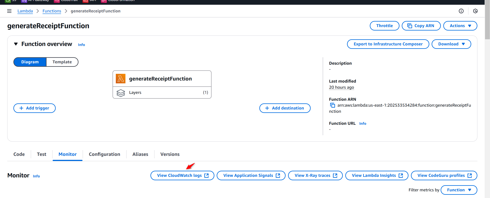

- Attach IAM Policy to LambdaEXecutoion role for cloud watch log

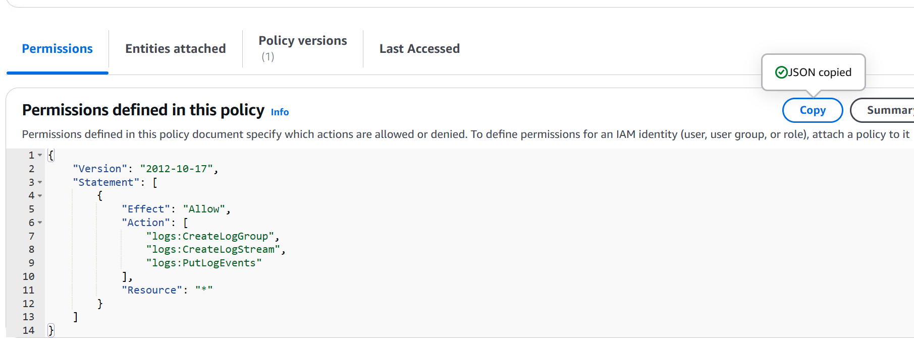

{
    "Version": "2012-10-17",
    "Statement": [
        {
            "Effect": "Allow",
            "Action": [
                "logs:CreateLogGroup",
                "logs:CreateLogStream",
                "logs:PutLogEvents"
            ],
            "Resource": "*"
        }
    ]
}

- Attach Policy to IAM LAmbdaexecution Role


- Monitor the logs
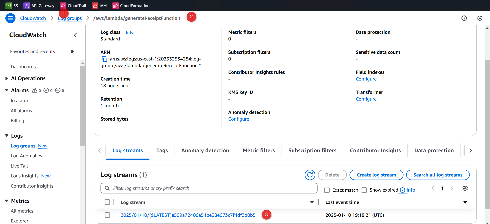

- Analyze the cloud watch logs for function execution to monitor what went wrong
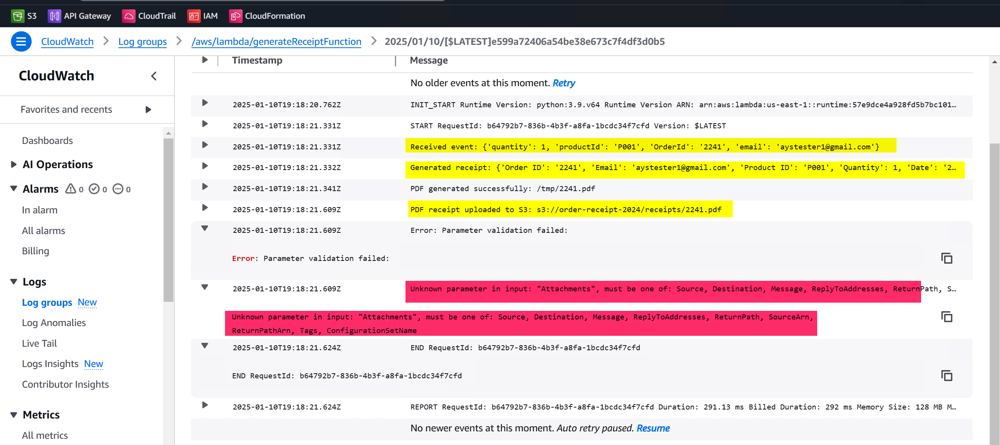


## frontend-ci.yml
## Frontend CI Pipeline

This GitHub Actions workflow automates the build and deployment process for the frontend of the order processing system. It runs on every push to the `master` branch, deploying the built artifacts to an S3 bucket.

### Workflow Configuration

```yaml
name: Frontend CI Pipeline

on:
  push:
    branches:
      - master

jobs:
  deploy:
    runs-on: ubuntu-latest
    permissions:
      id-token: write  # Required to generate OIDC token
      contents: read   # Required to read repo contents
    steps:

      # Step 1: Checkout the repository
      - name: Checkout Code
        uses: actions/checkout@v3

      # Step 2: Configure AWS Credentials
      - name: Configure AWS Credentials
        uses: aws-actions/configure-aws-credentials@v4
        with:
          role-to-assume: arn:aws:iam::202533534284:role/awsGitHubActionsRole1
          aws-region: us-east-1

      # Step 3: Set up Node.js environment
      - name: Install Node.js
        uses: actions/setup-node@v2
        with:
          node-version: '14'

      # Step 4: Install dependencies
      - name: Install dependencies
        run: npm install
        working-directory: ./frontend

      # Step 5: Build the frontend
      - name: Build frontend
        run: npm run build
        working-directory: ./frontend

      # Step 6: Upload build artifacts
      - name: Upload Build Artifacts
        uses: actions/upload-artifact@v3
        with:
          name: build
          path: frontend/build/

      # Step 7: Deploy to S3
      - name: Deploy to S3
        run: aws s3 sync ./frontend/build s3://ordeprocess-frontend/ --delete


## Steps Breakdown
# Checkout Code: Uses the actions/checkout@v3 action to pull the repository code.
# Configure AWS Credentials: Uses aws-actions/configure-aws-credentials@v4 to set up AWS credentials for deployment.
# Install Node.js: Sets up Node.js v14 for building the frontend.
# Install Dependencies: Installs the frontend dependencies using npm install.
# Build Frontend: Builds the React application using npm run build.
# Upload Build Artifacts: Uses actions/upload-artifact@v3 to upload the build artifacts for further use.
# Deploy to S3: Deploys the built frontend to the specified S3 bucket.


